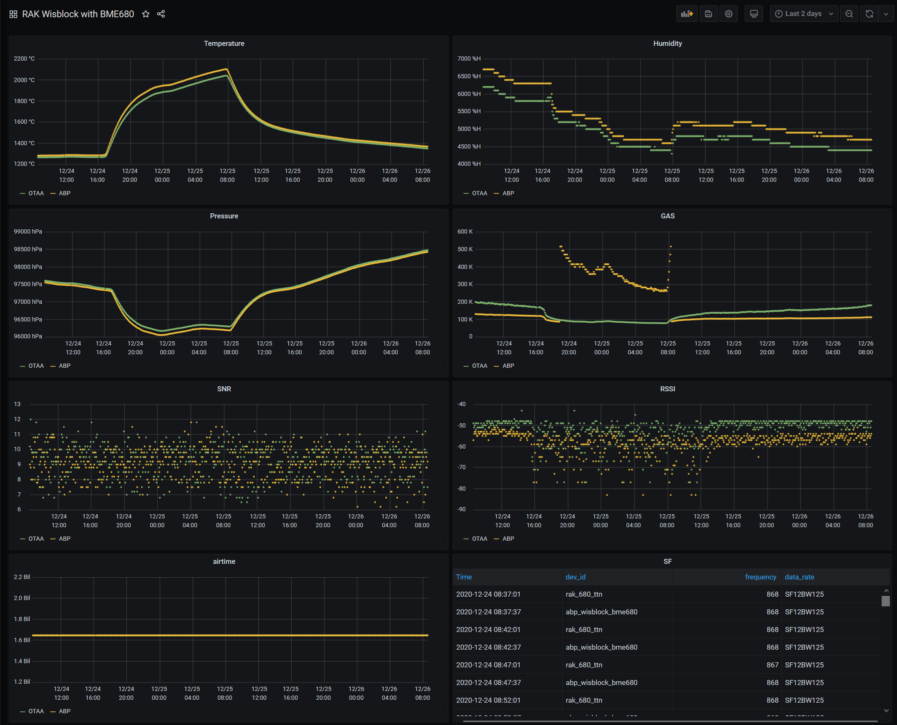

# LoRawan_Wisblock_BME680
Playground for thethingsnetwork LoRaWan using RakWireless new WISBLOCK "Lego" IoT blocks with Bosch BME680 (questionable IAQ sensor) and sensirion SCD30 (Awesome CO2 sensor).  
The idea is to provide a starter set for OTAA and ABP 
Change ADR, Data Rates, Confirm/Unconfirm,... 
Add Sensors/n
Get the data from TTN 
Save and Visualize the data with Node-Red, InfluxDB ad Grafana 

at the end, create a dashboard 

  

RAK Hardware documentation 
https://docs.rakwireless.com/Product-Categories/WisBlock/  

Decoding in the TTN console: available in the code 

